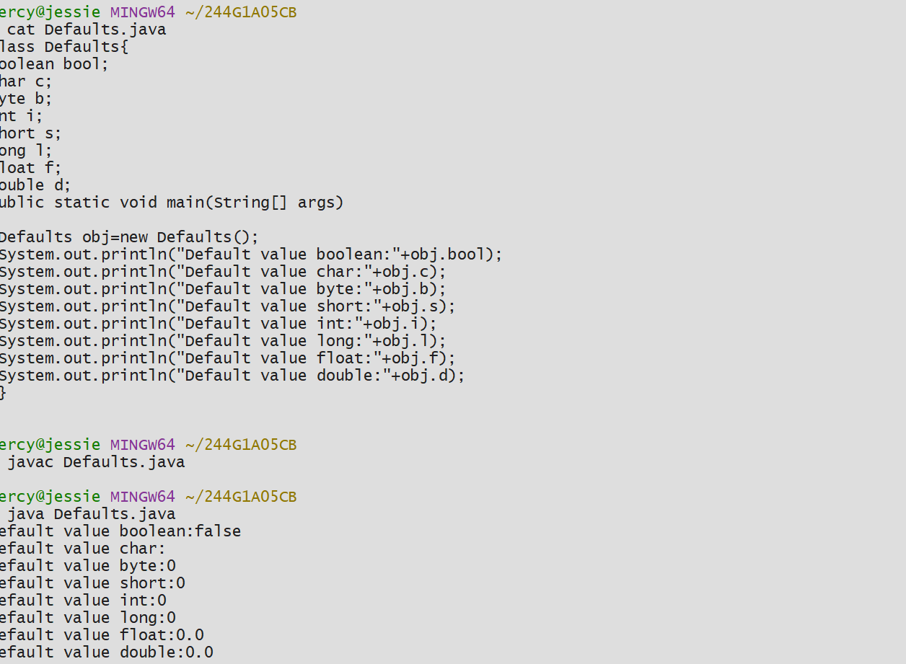
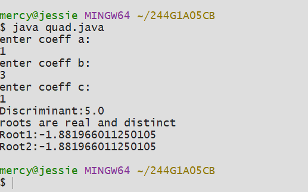
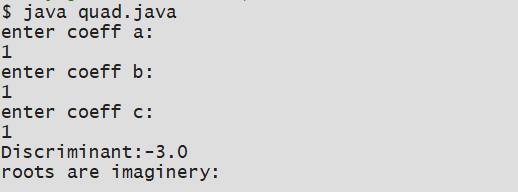

# Experiment-1
## exp-1 a Title: To display Primitive Data type
## Source Code
```java
class Defaults{
boolean bool;
char c;
byte b;
int i;
short s;
long l;
float f;
double d;
public static void main(String[] args)
{
 Defaults obj=new Defaults();
 System.out.println("Default value boolean:"+obj.bool);
 System.out.println("Default value char:"+obj.c);
 System.out.println("Default value byte:"+obj.b);
 System.out.println("Default value short:"+obj.s);
 System.out.println("Default value int:"+obj.i);
 System.out.println("Default value long:"+obj.l);
 System.out.println("Default value float:"+obj.f);
 System.out.println("Default value double:"+obj.d);
: }
}
```
## OUPUT


## Exp1b Title: Quadratic Equation
## Source Code:
```java
import java.util.Scanner;
public  class quad{
public static void main(String[] args)
{
 double a,b,c,d;
 Scanner sc=new Scanner(System.in);
 System.out.println("enter coeff a:");
 a=sc.nextDouble();
 System.out.println("enter coeff b:");
 b=sc.nextDouble();
 System.out.println("enter coeff c:");
 c=sc.nextDouble();
 d=b*b-4*a*c;
 System.out.println("Discriminant:"+d);
 if(d>0){
 double x1=(-b+Math.sqrt(d)/(2*a));
 double x2=(-b+Math.sqrt(d)/(2*a));
 System.out.println("roots are real and distinct");
 System.out.println("Root1:"+x1);
 System.out.println("Root2:"+x2);
}
 else if(d==0){
 double x=(-b/(2*a));
 System.out.println("Roots are real and  equal:");
 System.out.println("Root:"+x);
 }
 else{
 System.out.println("roots are imaginery:");
}
 sc.close();
 }
  }

```
## OUTPUT:
# CASE 1 ( D> 0):

## CASE 2 (D ==0):

## CASE 3 (D<0):

