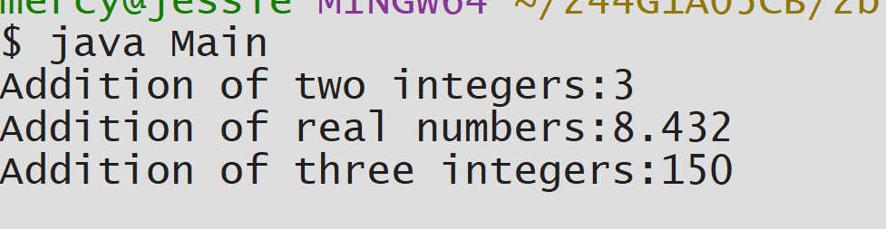

#EXPERIMENT-2
##exp 2a Title:To display Area and Perimeter of Square
```java
class Square{
int length;
int areaOfSquare(){
        return length*length;
}
int perimeterOfSquare(){
        return 4*length;
 }
}
public class Main{
public static void main(String args[])
{
Square sq=new Square();
sq.length=4;
int area=sq.areaOfSquare();
int perimeter=sq.perimeterOfSquare();
System.out.println("area of square:"+area);
System.out.println("perimeter of square:"+perimeter);
 }
}
```

#OUTPUT


##exp 2b Title:Method Overloading
```java
class Add {
static int Add(int a,int b){
        return a+b;
}
double Add(double a,double b){
        return a+b;
}
static int Add(int a,int b,int c){
        return a+b+c;
 }
}
public class Main {
public static void main(String[] args){
Add a=new Add();
System.out.println("Addition of two integers:"+a.Add(1,2));
System.out.println("Addition of real numbers:"+a.Add(3.567,4.865));
System.out.println("Addition of three integers:"+a.Add(40,50,60));
 }
}

```

#OUTPUT



##exp 2c Title:To implement Constructor
```java
class Student{
String name;
int age;
double marks;
Student(String n,int a,double m){
        name =n;
        age=a;
        marks=m;
}
void display(){
System.out.println("Student name:"+name);
System.out.println("Student marks:"+age);
System.out.println("Student marks:"+marks);
 }
}
public class Main{
public static void main(String[] args){
Student std=new Student("Raki",36,98.9);
std.display();
}
}

```
#OUTPUT

