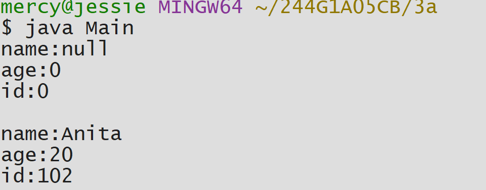
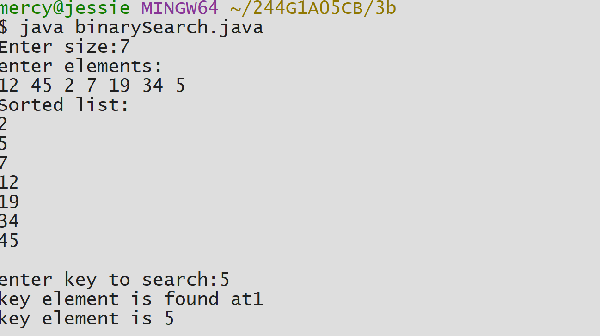
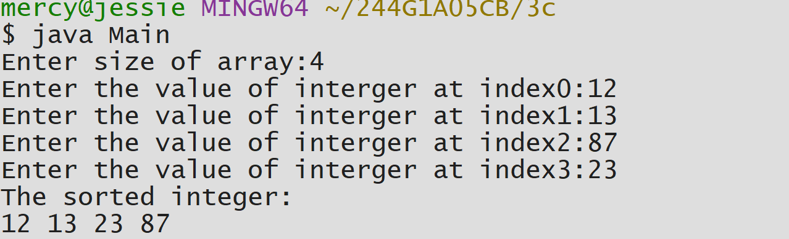

#EXPERIMENT 3
##EXP 3a)Title:Constructor overloading
```java

class Student {
int id;
String name;
int age;
Student() {

}

Student(int i,String n,int a){
id=i;
name=n;
age=a;
}
void display(){
System.out.println("name:"+name);
System.out.println("age:"+age);
System.out.println("id:"+id);
System.out.println();
}
}
public class Main{
public static void main(String[] args)
{
Student s1=new Student();
Student s2=new Student(102,"Anita",20);

s1.display();
s2.display();
 }
}

```

#OUTPUT:



##EXP 3b)Title:Binary search
```java
import java.util.Scanner;
import java.util.Arrays;

class binarySearch{
int list[];
int size;
int key=-1;
binarySearch(int size){
this.size=size;
list=new int[size];
}
void set_list(){
Scanner sc=new Scanner(System.in);
for(int i=0;i<list.length;i++){
list[i]=sc.nextInt();
 }
}
void get_list(){
for(int i=0;i<list.length;i++){
System.out.println(list[i]+" ");
}
System.out.println();
}
int binarySearch(int key){
int low=0;
int high=list.length - 1;
while(low<=high){
int mid=(low+high)/2;
if (list[mid]==key){
return mid;
}else if (list[mid]<key){
low=mid+1;
}else {
high=mid-1;
 }
}
return -1;
}
void getItem(int index){
System.out.println("key element is found at"+index);
System.out.println("key element is "+list[index]);
}
public static void main(String[] args){
Scanner sc=new Scanner(System.in);
System.out.print("Enter size:");
int size =sc.nextInt();
binarySearch s=new binarySearch(size);
System.out.println("enter elements:");
s.set_list();
Arrays.sort(s.list);
System.out.println("Sorted list:");
s.get_list();
System.out.print("enter key to search:");
int key =sc.nextInt();
int index=s.binarySearch(key);
if (index!=-1){
s.getItem(index);
}else{
System.out.println("key element not found");
  }
 }
}

```
#OUTPUT:



##EXP 3c)Title:Bubble sort
```java

import java.util.Scanner;
class Bubblesort {
void Bubblesort(int arr[]){
int n=arr.length;
int temp=0;
for (int i=0;i<n-1;i++){
        for(int j=0;j<n-i-1;j++){
                if(arr[j]>arr[j+1]){
                        temp=arr[j+1];
                        arr[j+1]=arr[j];
                        arr[j]=temp;
    }
   }
  }
 }
}
import java.util.Scanner;
class Main{
public static void main(String[] args){
Scanner sc=new Scanner(System.in);
System.out.print("Enter size of array:");
int size=sc.nextInt();
int[] integer=new int[size];
for(int i=0;i<size;i++){
System.out.print("Enter the value of interger at index"+i+":");
integer[i]=sc.nextInt();
}
Bubblesort bs=new Bubblesort();
bs.Bubblesort(integer);
System.out.println("The sorted integer:");
for(int i=0;i<size;i++){
System.out.print(integer[i]+" ");
  }
 }
}

```
#OUTPUT:



