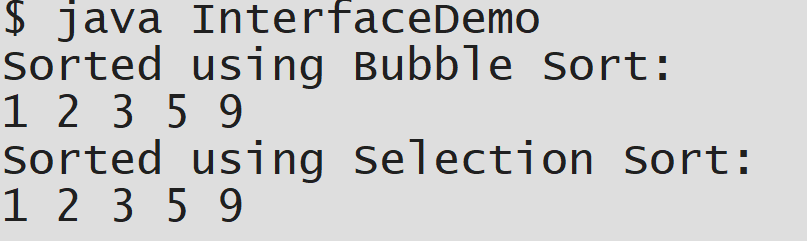
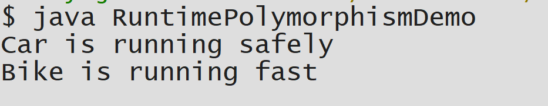
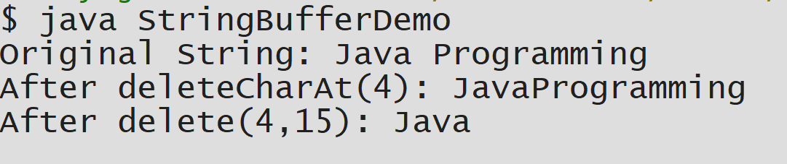

#EXPERIMENT-5
##5A Title:To Implement Interface
```java
interface Sortable {
    void sort(int arr[]);
}


class BubbleSort implements Sortable {
    public void sort(int arr[]) {
        int n = arr.length;
        for(int i = 0; i < n - 1; i++) {
            for(int j = 0; j < n - i - 1; j++) {
                if(arr[j] > arr[j + 1]) {
                    int temp = arr[j];
                    arr[j] = arr[j + 1];
                    arr[j + 1] = temp;
                }
            }
        }
        System.out.println("Sorted using Bubble Sort:");
        display(arr);
    }

    void display(int arr[]) {
        for(int num : arr) {
            System.out.print(num + " ");
        }
        System.out.println();
    }
}


class SelectionSort implements Sortable {
    public void sort(int arr[]) {
        int n = arr.length;
        for(int i = 0; i < n - 1; i++) {
            int minIndex = i;
            for(int j = i + 1; j < n; j++) {
                if(arr[j] < arr[minIndex]) {
                    minIndex = j;
                }
            }
            
            int temp = arr[minIndex];
            arr[minIndex] = arr[i];
            arr[i] = temp;
        }
        System.out.println("Sorted using Selection Sort:");
        display(arr);
    }

    void display(int arr[]) {
        for(int num : arr) {
            System.out.print(num + " ");
        }
        System.out.println();
    }
}


public class InterfaceDemo {
    public static void main(String[] args) {

        int arr1[] = {5, 2, 9, 1, 3};
        int arr2[] = {5, 2, 9, 1, 3};

        Sortable b = new BubbleSort();
        b.sort(arr1);

        Sortable s = new SelectionSort();
        s.sort(arr2);
    }
}

```
#OUTPUT:



##5B Title:To Implement Runtime Polymorphism
```java
class Vehicle {
    void run() {
        System.out.println("Vehicle is running");
    }
}
class Car extends Vehicle {
    @Override
    void run() {
        System.out.println("Car is running safely");
    }
}

class Bike extends Vehicle {
    @Override
    void run() {
        System.out.println("Bike is running fast");
    }
}


public class RuntimePolymorphismDemo {
    public static void main(String[] args) {

        Vehicle v;
        v= new Car();
        v.run();
        v = new Bike();
        v.run();
        v=new Vehicle();
        v.run();
    }
}

```
#OUTPUT:



##5C Title:StringBuffer
```java

public class StringBufferDemo {
    public static void main(String[] args) {

        StringBuffer sb = new StringBuffer("Java Programming");
        System.out.println("Original String: " + sb);
        sb.deleteCharAt(4);
        System.out.println("After deleteCharAt(4): " + sb);
        sb.delete(4, 15);
        System.out.println("After delete(4,15): " + sb);
  }
 }

```
#OUTPUT:


