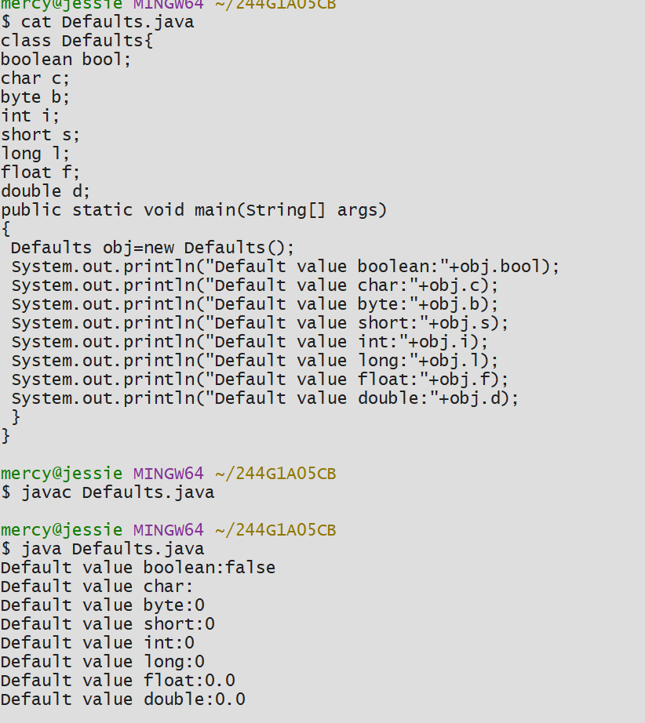

# EXPERIMENT 1
## TITLE: 1a.) Display the primitive datatypes
```
class Defaults{
boolean bool;
char c;
byte b;
int i;
short s;
long l;
float f;
double d;
public static void main(String[] args)
{
 Defaults obj=new Defaults();
 System.out.println("Default value boolean:"+obj.bool);
 System.out.println("Default value char:"+obj.c);
 System.out.println("Default value byte:"+obj.b);
 System.out.println("Default value short:"+obj.s);
 System.out.println("Default value int:"+obj.i);
 System.out.println("Default value long:"+obj.l);
 System.out.println("Default value float:"+obj.f);
 System.out.println("Default value double:"+obj.d);
 }
}

```
# OUTPUT

